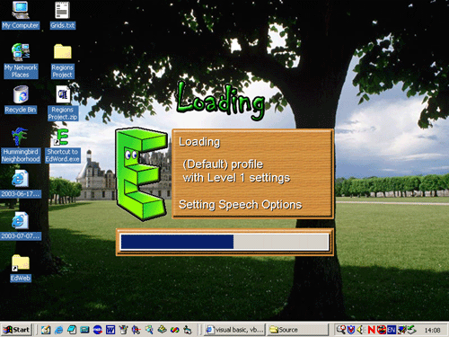



## Easy Ways to Create Non\-Rectangular Windows

### Description

This article demonstrates the use of regions for creating non-rectangular windows. It is very simple and easy to understand as you will see. It uses a picture to define the region hidding all the API stuff that may confuse some.
 
### More Info
 

             |
---                |---
**Submitted On**   |2003-07-17 13:52:16
**By**             |[Miltiadis Kritikos](https://github.com/Planet-Source-Code/PSCIndex/blob/master/ByAuthor/miltiadis-kritikos.md)
**Level**          |Intermediate
**User Rating**    |4.9 (73 globes from 15 users)
**Compatibility**  |VB 6\.0
**Category**       |[Graphics](https://github.com/Planet-Source-Code/PSCIndex/blob/master/ByCategory/graphics__1-46.md)
**World**          |[Visual Basic](https://github.com/Planet-Source-Code/PSCIndex/blob/master/ByWorld/visual-basic.md)
**Archive File**   |[Easy\_Ways\_1620297262003\.zip](https://github.com/Planet-Source-Code/miltiadis-kritikos-easy-ways-to-create-non-rectangular-windows__1-46979/archive/master.zip)

### Source Code

<h2>An easy way to generate non-rectangular window regions</h2>
<h3>What is this about?</h3>
This is a tutorial that demonstrates how to employ regions in order to create non-rectangular windows using VB.
<h3>Who should read that?</h3>
Intermediate VB programmers, even confident
beginners can understand what the code does. Anyway, I will try to explain
everything as good as I can in order to minimize any questions.
<h3>How does it Work?</h3>
The theory behind non-rectangular windows is
simple. You just ask Windows to paint only a portion of you form. You achieve
this by using Regions.
<h3>What are these Regions?</h3>
They come in the form of handles (Long values)
and they generally describe an area. I know this is not the best definition but
this is all we really need to know.
<h3>Ok, but how do I make a non-rectangular window?</h3>
You first have to create a region, and then you
have to assign it to a window. From then on any painting (refreshing)
operations will only occur within this area. The rest of the window will be
invisible and you will be able to see what’s behind this area of the window.
You can have a window with holes too.
<h3>Ok…But how do I make a non-rectangular window?</h3>
Windows API (don’t worry its not hard at all,
it’s pure Windows) provides us with some functions to create regions. There are
functions to create rectangular regions, elliptical regions, rectangular
regions with rounded corners and polygonal regions. With these functions you
can create any region you like. There are also some other functions that allow
you to combine these regions in a number of ways. Finally there is this final
API function that assigns this region to your form and makes it change its
shape.
<h3>Am I supposed to write a sequence of these API calls to generate my
Region at runtime? It sounds like a lot of work to me. Maybe I’ll stick to the good old VB forms.</h3>
What if there was an easier way? Say, using a
picture to generate your region, by excluding pixels of a certain color. This
way you can draw your nice picture in a program such as Paint or PhotoShop,
assign it to your form and have the region generated and assigned to your
window automatically.
<h3>How can I create a region from a picture?</h3>
This program demonstrates the method. The steps
are easy to understand. Let’s have a look at them:
<ol>
 <li>Load a picture in a picture box that has its Autosize and Autodraw properties set to True</li>
 <li>Create a rectangular region with the picture’s dimensions using the API call CreateRectRgn
  make sure to pass dimension information in pixels (not twips)</li>
 <li>For each pixel of the picture, check if it’s color should be excluded from the region.</li>
 <li>Exclude a pixel of a certain color by creating a one pixel region using CreateRectRgn and passing
 	 the coordinates of that pixel. Then combine the region created on step 2 with this (one-pixel)
  region using the API call CombineRgn passing RGN_XOR as the last parameter. This will exclude the one-pixel
  region from the Rectangular region</li>
 <li>After you have checked all the pixels and excluded those that you do not want
  from the region, you have your final region. You can assign it to your
  window right away by using the API call SetWindowRgn passing the handle of your form (hWnd) and the final
  region.</li>
</ol>
<h3>It takes ages to create the region when the picture is big.</h3>
I know what you mean. There is a way to get the
final region data and save them into a byte array. Then we can pass this array
to an API function and create that region in an instance. The function to
retrieve the data from the region is called GetRegionData
and the one to create the region from the byte array is called ExtCreateRegion
both are demonstrated in the demo program.
<h3>Things get too complicated with these byte arrays and region data. Is
there a fast and easy way to do this?</h3>
That’s why I created this program. All you have
to do is:
<ol>
 <li>Click the open button that brings up the well known Open Dialog</li>
 <li>Select a picture that you want to use as region (magenta colored pixels are
  excluded)</li>
 <li>Wait while the region is created</li>
 <li>And finally the program generates the source code needed in order to recreate
  this region in an instance. You can copy and paste this source code from
  the text control provided on the form (or from the file generated in the
  application folder) to your project and call it to create this region in
  an instance. Alternatively you can use the generated binary file. See
  example code for details.</li>
</ol>
<h3>That sounds easy. How do I use this code in my own project?</h3>
<ol>
<li>Change the BorderStyle of your form to None</li>
<li>Add a picture box with its AutoSize property set to True and BorderStyle set to None</li>
<li>Set the picture property of the picture box to the picture you
 used to create the region. (You can skip step 2 and in
 this step you can use the Picture property of the form to do the job, but I
 found that it shrinks WMF files so I use a PictureBox that seems to work fine)</li>
<li>Copy and Paste the generated code into a module or form</li>
<li>Call CreateRegion when ready by passing the name of the form as parameter.</li>
</ol>
<h3>What can I do with the binary file</h3>
<ol>
<li>You can load it at runtime and set the region as demonstrated by the sample program 3</li>
<li>You can save it as a resource and set it at runtime. I personally prefer the resource
 method because you do not have to load external files, or paste dozens of lines of
 code to do it. Just a few calls and the job is done. Take a look at the
	sample program 4 to see how easy it can be.</li>
</ol>
<h3>How can I move my form around using the mouse?</h3>
Just add the following code to process the
mouse down event of the picture box. You form will behave as if it is being
dragged by the title bar (if it had one). Change it to process the form’s mouse
down event if you are using the Form to store your picture instead of a PictureBox 
 Private Declare Function SendMessage "user32" Alias "SendMessageA" (ByVal hWnd
 As Long, ByVal wMsg As Long, ByVal wParam As Long, lParam As Any) As Long 
Private Declare Function ReleaseCapture Lib "user32" () As Long
Private Const WM_NCLBUTTONDOWN = &HA1 
Private Const HTCAPTION = 2  
' Add this code to move the form with the mouse 
Private Sub pctTest_MouseDown (Button As Integer, Shift As Integer, X As Single,Y As Single) 
ReleaseCapture 
SendMessage Me.hWnd, WM_NCLBUTTONDOWN, HTCAPTION, 0& 
End Sub

